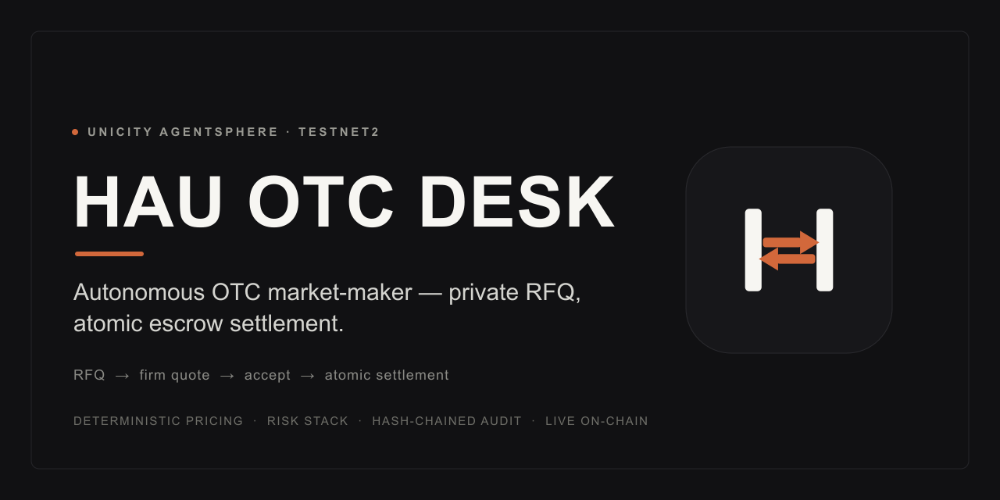

# sphere-otc-desk



An autonomous **crypto OTC market-maker agent** for the Unicity AgentSphere. It
advertises a two-way market in UCT/USDU, answers RFQs with deterministic firm
quotes, haggles within a reservation band, and settles each trade as an
**atomic swap through a dedicated escrow agent** — both legs pay out crossed
once both arrive, or refund on timeout. (The native non-custodial predicate
swap isn't on testnet2 yet — see *Settlement* below.)

**Live on Unicity testnet2** as `@hau-otc-desk` — funded with real testnet UCT,
posting a market intent, and negotiating with counterparties over encrypted DMs.
A companion **taker** agent (`@hau-taker`) and an **escrow** agent (`@hau-escrow`)
drive the full machine-to-machine loop: RFQ → firm quote → accept → both legs
deposited to the escrow → atomic settlement. Proven end to end on testnet2.

- **Build track:** Autonomous Agents (also fits Payments + Markets)
- **Agentic:** yes — the desk decides when and how to quote, finds counterparties
  via the market/DMs, and settles programmatically; a human only sets goals and
  risk limits.
- **Runtime:** Node, bare Sphere SDK (not on AstridOS)
- **Network:** Unicity testnet2 (`SPHERE_NETWORK=testnet`)

## Quick demo (testnet2)

```bash
npm install
cp .env.example .env      # set DESK_NAMETAG, ORACLE_API_KEY (public testnet2 key)

# 1. Run the escrow agent — the neutral coordinator that settles both legs
npm run escrow

# 2. (another terminal) run the desk — registers a nametag, posts intent, listens
npm run live

# 3. (another terminal) fund a taker wallet, then RFQ the desk
npm run mint  -- USDU 100        # mint testnet USDU into the taker wallet (no faucet)
npm run taker -- buy 5           # taker RFQs; the desk replies with a firm quote
npm run taker -- buy 5 --accept  # full loop: quote -> accept -> escrow settles

# Offline (no network): deterministic sim + test suite
npm run sim && npm run safetycheck && npm run pnlcheck   # …and more (see scripts)
```

See `docs/SETTLEMENT-MODEL.md` for the settlement analysis — our escrow agent as
shipped today, and the native non-custodial predicate swap on the roadmap.

## Why this shape

The single most important rule of the desk:

> **Pricing and risk are deterministic code. The LLM never sets a price.**

So the architecture splits cleanly:

```
src/domain/        ← pure, no SDK import, unit-testable
  types.ts           wire protocol + domain types (amounts are bigint smallest-units)
  priceFeed.ts       PriceFeed interface + Static / Composite / Median feeds
  quoteEngine.ts     mid ± spread, decimal-correct, risk-gated  → Quote | Rejection
  inventory.ts       balances, reservations, per-counterparty & exposure limits
  negotiation.ts     quote↔counter state machine; emits Effects (no IO)

src/adapters/
  priceFeeds.ts      CryptoComPriceFeed — live mid from Crypto.com public REST
  sphereDesk.ts      binds the core to the live SDK: DMs ↔ negotiation ↔ sphere.swap

  persistence.ts     Store interface + DeskSnapshot + MemoryStore
  killSwitch.ts      manual halt + auto circuit breaker (gates new risk)
  pnl.ts             mark-to-market equity + daily-loss breaker (pure)
  prelock.ts         pre-lock policy: timeout bounds + verification gate (pure)
  audit.ts           hash-chained audit format + pure verifyChain

src/adapters/
  fileStore.ts       atomic JSON snapshot store (temp-write + rename)
  persister.ts       debounced snapshot writer
  fileAuditLog.ts    append-only JSONL audit, fsync'd, chain continues on restart
  counterpartyVerifier.ts  on-chain counterparty check (interface + Sphere/null)

src/ops/             ops dashboard (reads state + audit, writes HTML)
  metrics.ts         pure: snapshot + audit events → DashboardModel
  render.ts          pure: model → Grafana-style HTML (full doc + fragment)
  generate.ts        read files → write dashboard HTML
  dashboard.ts       CLI entry (reads STATE_FILE / AUDIT_FILE)
  demo.ts            generate a populated sample + render (no testnet)

src/deskConfig.ts    pairs, limits, seed inventory — shared by sim and live
src/sim/simulate.ts  offline end-to-end walkthrough (no SDK, no testnet)
src/index.ts         live headless agent (Node providers + market intent)
```

The `NegotiationEngine` is **pure**: every handler returns an `Effects` object
(`replies`, optional `startSwap`, `logs`) that the adapter executes. That keeps
all the trading logic testable with zero network and makes the settlement
handoff explicit.

## Run the offline simulation

No install of the SDK or testnet needed — just the dev tooling:

```bash
npm install
npm run sim
```

You'll see four scenarios: a buy that settles, an oversize RFQ rejected by the
risk gate, a sell with a counter-offer that's rejected then re-quoted within the
reservation band and settled, and an RFQ for an unlisted pair.

## Two-way: proposer and acceptor

```bash
npm run acceptorcheck   # desk evaluates swaps proposed *to* it
```

The desk works both directions:

- **Proposer** — after its own quote is accepted, it opens the swap: it registers
  the deal with the escrow agent, tells the counterparty to pay its leg, and
  deposits its own leg (`openSwap` in the adapter). Driven by the RFQ/negotiation
  loop.
- **Acceptor** — another agent proposes terms directly, and `evaluateProposal()`
  applies the **same deterministic price + risk logic** as quoting: it accepts
  only if the implied price clears the desk's reservation and every risk gate
  passes, otherwise it rejects. (The pure logic is covered by `acceptorcheck`;
  the direct-proposal wiring targets the native `sphere.swap` path for when it
  ships on v2.)

An accepted proposal synthesizes a `Quote` and an agreed session keyed by
`swapId`, so settlement, persistence, and restart-reconciliation all reuse the
proposer machinery unchanged.

## Durability (restart-safety)

```bash
npm run persistcheck   # proves an agreed deal survives a restart and still settles
```

The desk persists a `DeskSnapshot` (reservations, daily/exposure counters, and
every non-terminal session incl. its `swapId`) after each state change, via a
debounced atomic-rename file write (`./wallet-data/desk-state.json`). The
`swapId` is flushed **synchronously** right after the swap is opened, so a crash
in the gap between opening a swap and its first event can never orphan a deal.
(The escrow agent has its own durable state — see *Settlement* below — so a
crash on either side self-heals.)

On boot, `index.ts`:
1. loads the snapshot and rehydrates the ledger + in-flight sessions;
2. calls `reconcile()` — reconciles each agreed deal, aborting deals whose swap
   was never opened and releasing reservations for terminal ones; the escrow
   agent independently drives any in-flight swap to settle-or-refund (below) and
   the desk applies the `escrow_settled` / `escrow_refunded` callback when it
   lands.

**Source-of-truth rule:** the *chain* is authoritative for balances, the
*snapshot* for reservations. A fresh start (no snapshot) seeds free balances from
`sphere.payments.getBalance()`; a restart trusts the snapshot's free balances
(which already net out reservations) and lets `reconcile()` correct in-flight
outcomes.

The **kill-switch / breaker state is persisted too**, so a latched halt survives
a restart — the desk never boots back into a hot state after a crash caused by
the very condition that tripped the breaker.

**Rolling daily limits** reset at each UTC midnight via `startDailyReset()`
(`inventory.rollDay()` + an audited `limits_rolled` event), so the
per-counterparty daily cap is a true 24h rolling window.

**Periodic chain↔ledger true-up** (`startTrueUp`, every `TRUEUP_INTERVAL_MS`)
corrects drift between the desk ledger and the chain. The invariant it enforces:
`free[coin] = chainTotal[coin] − Σ reservations still in the wallet`. A leg that
has been deposited to escrow has left the wallet (tracked by a `deposited` flag
set when the deposit is paid), so it is *not* subtracted; an undeposited
reservation still sits in the wallet, so it is. If the chain is below pending
reservations, the true-up warns and leaves the balance untouched rather than
writing a negative.

## Ops dashboard

```bash
npm run dashboard:demo   # populated sample → demo/dashboard.html (no testnet)
npm run dashboard        # from the live STATE_FILE + AUDIT_FILE → DASHBOARD_OUT
```

A self-contained, dark "Grafana-style" HTML dashboard rendered from the snapshot
+ audit log: status pill (RUNNING / HALTED + reason), stat panels (equity, daily
P&L, open exposure, open deals, swaps done/failed), inventory, open deals, an
event-mix breakdown, recent activity, and an **audit-integrity badge** that
re-verifies the hash chain. No external assets — open the file in a browser and
screenshot it. `render.ts` also exports `renderFragment()` for embedding the
panel elsewhere.

## Pre-lock counterparty check

```bash
npm run prelockcheck   # timeout bounds + verification gate
```

Before the desk commits its own token to a swap, it runs the cheap checks that
cover the residual settlement risks from `docs/SETTLEMENT-MODEL.md`:

- **Timeout bounds** (`PRELOCK_BOUNDS`, pure, in the quote engine) — an inbound
  proposal whose `timeout` is below `minTimeoutSec` (late-lock risk) or above
  `maxTimeoutSec` (liquidity held hostage) is rejected *before* any inventory is
  reserved.
- **Counterparty verification** (`CounterpartyVerifier`, adapter) — runs right
  before the desk deposits its leg. The Sphere implementation confirms the counterparty
  identity resolves; the deeper ownership + non-inclusion proof is a marked TODO
  pending an SDK uniqueness-service primitive. `REQUIRE_VERIFICATION=true` blocks
  on failure (releasing the reservation); `false` runs warn-only. Every check is
  audited (`prelock_check`).

The desk also defaults to a short swap `timeout` (1800s) to limit liquidity
lock-up. See `docs/SETTLEMENT-MODEL.md` for the rationale.

## Safety rails (minimum to hold real money)

```bash
npm run safetycheck   # kill-switch + circuit breaker + tamper-evident audit
```

**Kill-switch** gates every entry point that creates *new* risk (quoting,
accepting proposals, opening swaps). In-flight deals are never blocked — they
must settle or be refunded by the escrow regardless. Two triggers:

- **Manual** — create the control file to pause, remove it to resume:
  `touch ./wallet-data/HALT` / `rm ./wallet-data/HALT` (polled every 3s).
- **Automatic circuit breaker** — auto-halts after `MAX_CONSEC_FAILURES`
  consecutive swap failures (the classic "escrow/counterparties are misbehaving,
  stop taking risk"). A successful settle resets the counter.
- **P&L breaker** — marks all inventory to USDU at the current mid every
  `PNL_INTERVAL_MS` and auto-halts when the day's drawdown reaches
  `MAX_DAILY_LOSS_USDU`. Equity = Σ(coin balance × mid), so it captures both
  spread earned and mark-to-market loss from holding inventory while the mid
  moved. The baseline resets at each UTC day and persists across restarts within
  the day. A mark with any unpriceable coin is skipped (never acted on).

**Audit log** is append-only JSON Lines, **hash-chained** (each record commits to
the previous record's hash) and fsync'd before acknowledgement, so truncation or
tampering is detectable — `FileAuditLog.verifyFile()` recomputes the whole chain
and reports the first broken `seq`. Every money/risk event is recorded:
`quote_issued`, `rfq_rejected`, `deal_agreed`, `swap_proposed`, `deposit_sent`,
`proposal_accepted/rejected`, `swap_completed/failed/cancelled`,
`kill_halted/resumed`, `boot`, `shutdown`.

## Live price feed

```bash
npm run pricecheck   # hits the real Crypto.com public API
```

The reference price is a **`CompositePriceFeed`**: a manual override for illiquid
OTC tokens (UCT has no CEX market — set `UCT_USDU_MID`) layered over a
**`MedianPriceFeed`** of live exchange feeds for liquid pairs (BTC/ETH → `*_USDT`,
since USDU is a USD stablecoin).

Hardening:
- **Multi-venue median** — the median of all responding venues (Crypto.com +
  Binance), so a single venue printing a bad price is medianed out. Refuses
  unless `MIN_PRICE_SOURCES` venues respond (1 = quote on one venue, 2 = require
  quorum).
- **Staleness guard** — `CryptoComPriceFeed` never serves a cached price older
  than `maxStaleMs` (30s) on error; beyond that it returns `null`.
- **Sanity band** — a bid/ask mid that deviates from the last trade by more than
  `maxDeviationBps` (5%) is rejected as a crossed/stale book.
- **Never throws** — any failure returns `null`, so the desk declines to quote
  rather than price off a missing/stale number. The quote engine still applies
  spread; the feed only supplies the mid.

## Run live (testnet)

```bash
npm install                # SDK ^0.10.5 (the swap module lives in 0.10.x, not 0.4.x)
cp .env.example .env       # set SPHERE_NETWORK, DESK_NAMETAG, ORACLE_API_KEY…
npm run live
```

`index.ts` boots the SDK (`network` forwarded to `Sphere.init`, `accounting:
true` + `swap` enabled for atomic swaps), registers the `@nametag`, reconciles
inventory against `sphere.payments.getBalance()`, posts a market intent
advertising the desk, and listens for RFQs.

**Verified against the live testnet:** `Sphere.init` connects to
`wss://nostr-relay.testnet.unicity.network`, registers the nametag, and creates a
`DIRECT://` identity. Two gotchas are handled for you:

- **WebSocket** — Node's built-in (undici) global WebSocket fails against the
  relay; `src/adapters/wsShim.ts` forces the `ws` package and is imported first
  in `index.ts`. Don't remove that import.
- **`network`** — must be passed to `Sphere.init` (not just `createNodeProviders`),
  or init throws `INVALID_CONFIG` (token registry).

To actually trade you need inventory: fund the wallet from the Unicity faucet
(`unicitynetwork/js-faucet`) and set `ORACLE_API_KEY` (testnet gateway auth — the
SDK warns and runs unauthenticated without it). A fresh wallet has balance 0, so
the desk will post its intent but reject RFQs with `INSUFFICIENT_INVENTORY` until
funded.

## Settlement (escrow agent today, native swap on the roadmap)

The protocol's native non-custodial predicate swap (`sphere.swap`) **isn't
migrated to testnet2 yet** — the docs' `@escrow-testnet` returns
`SWAP_RESOLVE_FAILED`, which the Unicity team confirmed is an oversight ("feel
free to implement your own for now"; native escrow ETA "this year"). So this repo
ships its **own escrow agent** (`src/ops/escrow.ts`, `@hau-escrow`, `npm run
escrow`).

**How it settles.** On accept, the desk registers the swap with the escrow, tells
the taker to pay its leg, and deposits its own — all as memo-tagged wallet-api
transfers keyed by `swapId`. The escrow holds both legs and pays them out
**crossed** only when both arrive (`escrow_settled`), and **refunds** a lone leg
on timeout (`escrow_refunded`). Atomic from each party's view: both complete, or
both keep their tokens. The escrow never nets a token — it pays out exactly what
it receives — so it's a neutral coordinator, not a profit-taking middleman.

**Robust by construction.** Because live `transfer:incoming` events don't replay
across a restart, the escrow treats the **chain as the source of truth**: it
persists swap state to disk, and on every tick reconciles which legs it holds
from the actual wallet balance (allocating greedily so concurrent swaps never
double-count), retrying the payout until it sticks. A mid-swap crash or a
transient wallet-api/DNS blip self-heals; `escrow_open` is idempotent so a
re-delivered mailbox message can't wipe recorded legs.

This is **escrow-based** (the agent custodies both legs for the few seconds
between deposit and payout) — honest framing, not the trustless non-custodial
model. When the native predicate swap lands on v2, the desk swaps back to
`sphere.swap` with **no change to the negotiation or risk layers**.
`docs/SETTLEMENT-MODEL.md` documents that native model (from Unicity's formal
paper *"Predicates and Atomic Swaps"*) as the target end-state.

## Next (Phase 2+)

Everything below is enhancement — settlement works end to end via the escrow
agent, and the risk stack (two-venue median, daily-limits scheduler, kill-switch
+ failure breaker + P&L breaker, hash-chained audit, chain↔ledger true-up, ops
dashboard) is wired.

- **Swap back to native `sphere.swap`** once the predicate-based non-custodial
  escrow lands on v2 (Unicity ETA "this year") — no change to the negotiation or
  risk layers; `docs/SETTLEMENT-MODEL.md` is the target model.
- **Pre-lock counterparty check**: deepen `CounterpartyVerifier` to a full
  ownership + non-inclusion proof once the SDK exposes the uniqueness-service
  primitive.
